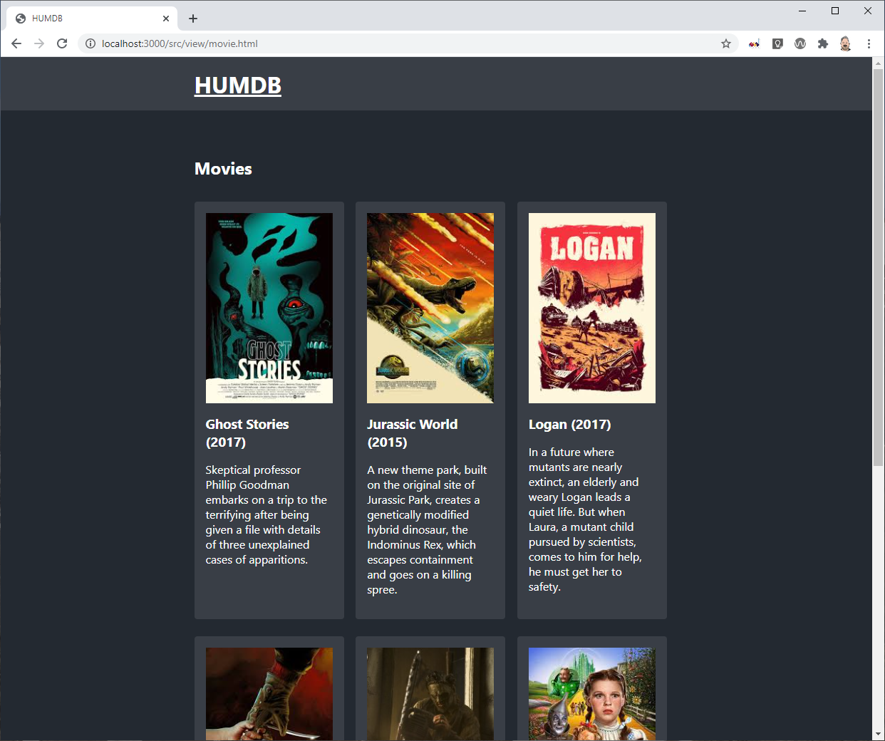
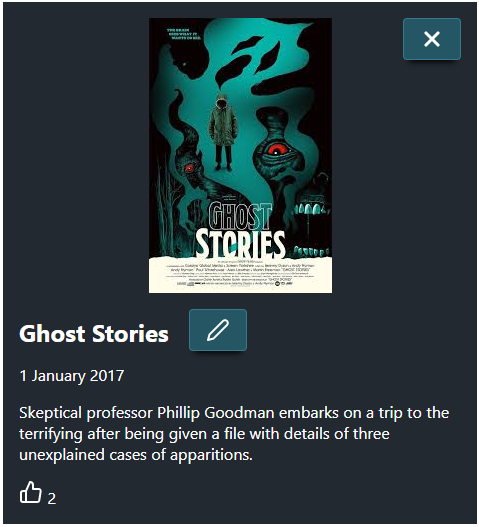
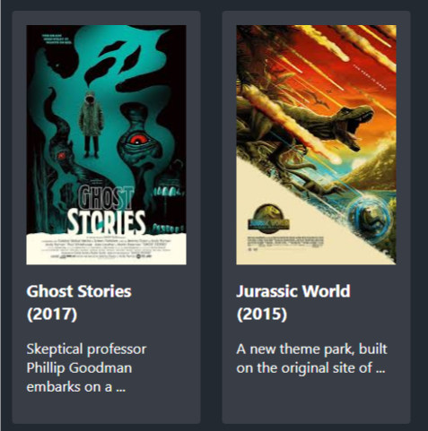
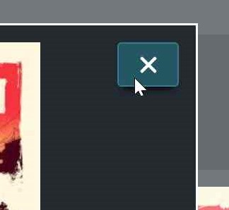
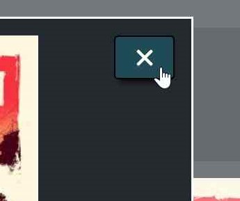
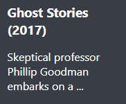

= Front End Programming
:icons: font 
ifdef::env-github[]
:tip-caption: :bulb:
:note-caption: :information_source:
:important-caption: :heavy_exclamation_mark:
:caution-caption: :fire:
:warning-caption: :warning:
endif::[]

image::assets/hu-logo-nl.svg[]


= FEP1 Tentamen - HUMDB
__maandag 19 October 2020__

== Puntjes vooraf
- Open link:https://teams.microsoft.com/l/meetup-join/19%3ameeting_Y2FiOWQ5YzgtM2Y2MC00YjA3LWI5NzUtNTMzODkzZmQxYTUw%40thread.v2/0?context=%7b%22Tid%22%3a%2298932909-9a5a-4d18-ace4-7236b5b5e11d%22%2c%22Oid%22%3a%22f85a4f5b-1753-4f36-9859-6c1330cbfc1b%22%7d[deze MS-Teams bijeenkomst] en hou in elk geval de chat van dit kanaal gedurende het tentamen open. 
Mochten mochten er onverwacht toch weer problemen zijn met het tentamen / dan zullen we via dat chat van dat kanaal aangeven hoe hiermee om te gaan. Gebruik dit chat kanaal echter niet voor discussie etc. Het is uitsluitend bedoeld om vragen aan ons te kunnen stellen (mochten we even niet via de video beschikbaar zijn), dan wel om aanwijzingen van ons te kunnen ontvangen die alle deelnemers van het tentamen betreffen.

- Om de verleiding / kans op plagiaat te verlagen willen we je vragen om uit te loggen uit Discord / deze af te sluiten. 
Indien we wel plagiaat constateren moeten we dit bij de examencommissie melden en die bestraffen dit over het algemeen wel erg zwaar tot met uitsluiting van ALLE tentamens voor enkele maanden!

- De reguliere tentamentijd voor dit tentamen is 2,5 uur. Op de GitHub server staat een deadline ingesteld. Na verstrekken van de deadline kun je weliswaar nog steeds naar de repository pushen, maar we zullen pushes na de deadline niet mee nemen in de beoordeling. We adviseren derhalve om geregeld dat wat je wel al af hebt te committen en te pushen. Je bent er zelf voor verantwoordelijk dat je de code hebt ingeleverd.

- Aanpassingen aan de code dient je uitsluitend te beperken tot de bestanden in de map `/public/src`. En dan ook alleen op de in de opdracht aangewezen onderdelen. Aanpassingen aan de server en of andere functies zouden kunnen leiden tot een onvoldoende voor de tentamen!!!

- Verder dien je geen nieuwe tools / libraries zoals bootstrap, jquery, lodash, moment.js etc aan het project toe te voegen. Ook dat soort aanpassingen aan het project kunnen leiden tot een onvoldoende.

- Sommige Intellij gebruikers ervaren het probleem dat Intellij o.a. de import's in de javascript files aanpast, door o.a. de file extensie te verwijderen. Deze automatische optimalisatie resulteerd echter in niet werkende code. Maak je gebruik van Intellij check dan a.u.b. de imports ten opzichte van wat er op github in de code staat.

- Nadat je het project hebt gecloned en `npm install` en erna `npm start` hebt uitgevoerd zou je via `http:\\localhost:3000` het volgende te zien moeten krijgen:



Indien dit niet het geval is check dat de npm server is gestart en je in de browser de juiste port hebt meegegeven.


== De beoordeling ==
Bij elke opdracht staat aangegeven op welk lesonderdeel de opdracht betrekking heeft (JS, HTML, CSS en WEB). Voor elke opdracht scoor je een geheel cijfer (0-10) waarbij we in de beoordeling gebruik zullen maken van de volgende beoordelingsmatrix:

.Tabel Beoordelingsmatrix
|===
| werkende opdracht | 50% van het opdrachtcijfer | wordt altijd beoordeeld met werk wel / niet
| commentaar bij de opdracht | 20% van het opdrachtcijfer | wordt altijd beoordeeld
| optimale code | 20% van het opdrachtcijfer | hiermee wordt bedoeld of je bijvoorbeeld omslachtig geprogrammeerd hebt en het efficienter had gekund, dan wel dat je wel rekening hebt gehouden met uitzonderingen etc. Dit onderdeel wordt alleen beoordeeld als aan eerste twee onderdelen (werkende opdracht en commentaar) is voldaan.
| kwaliteit | 10% van het opdrachtcijfer | Hier zijn de 2 documenten omtrent de codeing standaards leading. Dit onderdeel wordt alleen beoordeeld als aan de eerste twee onderdelen is voldaan.
|===

NOTE: Wil je dus een cijfer >5.5 voor een opdracht dan moet die dus minimaal werken en van commentaar zijn voorzien.

Het commentaar dient niet heel erg uitgebreid te zijn, maar moet ons duidelijk maken dat je door hebt wat je hebt gedaan en waarom je het zo hebt gedaan.

Met de examencommissie is afgestemd dat het ons vrij staat om bij verdacht op plagiaat / twijfel de betreffende student(en) in voor een gesprek uit te nodigen voorafgaande aan de bekend making van de cijfers. 

WARNING: **LET WEL: Indien we plagiaat constateren moeten we dit melden aan de examencommissie en daar staan zware sancties op!!!**

Dus weersta de verleiding om snel even iemand te vragen om je te helpen en maak de opdrachten zelf.

De opdrachten wegen echter niet allemaal even zwaar mee in het eindcijfer. 
Het eindcijfer is het gemiddelde van de cijfers van alle opdrachten bij elkaar opgeteld, waarbij de JS & WEB opdrachten een gewicht van 2 hebben en de HTML en CSS opdrachten een gewicht van 1 (zodoende correspondeert dit met het aantal lesweken van dat onderwerp).
Je eindcijfer wordt dus als volgt berekend:

  eindcijfer = (
      2 * SOM(opdracht cijfers JS opdrachten) / aantal JS opdrachten + 
      SOM (opdracht cijfers HTML opdrachten) / aantal HTML opdrachten + 
      SOM (opdracht cijfers CSS opdrachten) / aantal CSS opdrachten + 
      2 * SOM (opdracht cijfers WEB opdrachten 
      ) / aantal WEB opdrachten) / 6

== De opdrachten ==
Zet bij elke file die aanpast bovenin in het commentaar:

- je studentennummer
- je naam
- en je klas (voor studenten die niet officieel in een klas zitten kunnen hier klasX opgeven)

En dan nu de opdrachten:

. [CSS] Zorg ervoor dat de 'x'-button voor het sluiten van de dialog op de juiste positie (rechtsboven) wordt gepositioneerd, zoals in onderstaande afbeelding. Deze aanpassing doe je in de file `dialog.css`.



[start=2]
. [CSS] Momenteel staan op schermen kleiner dan 760px alle films onder elkaar gepositioneerd. Op schermen groter dan 760px staan er drie films naast elkaar. Zorg ervoor dat er op schermen tussen de 500px en de 760px 2 films naast elkaar komen te staan. Zorg ervoor dat deze twee films naast elkaar uitlijnen, met een ruimte van 1.5rem / 24px ertussen, zoals op de volgende afbeelding:



[start=3]
. [HTML] Zorg ervoor dat een gebruiker bij het aanpassen/editen van een movie ook een nieuwe afbeelding kan toevoegen, zodanig dat ook voor gebruikers van een screen reader duidelijk is dat zij een afbeelding kunnen toevoegen. Let wel erop dat de naam van het veld voor het toevoegen van de afbeelding gelijk is aan `image`.    

[start=4]
. [CSS] Momenteel is er geen visuele feedback voor de gebruiker wanneer zij met hun muiscursor over een button heen gaan:



Zorg ervoor dat de gebruiker visuele feedback krijgt wanneer zij met hun muiscursor op een button zijn, bijvoorbeeld op de volgende manier (je mag een andere styling kiezen):



Zorg er ook voor dat keyboardgebruikers dezelfde visuele feedback krijgen wanneer zij met hun tabtoets door de pagina navigeren en op een button zijn beland. Maak de aanpassingen hiervoor in `button.css`.

[start=5]
. [JS] Op dit moment wordt de beschrijving van movie volledig weergegeven. De functie `shortDescription` welke de description en een maximale lengte mee krijgt zou de beschrijving moeten inkorten.
Echter de functie dient de beschrijving zodanig in te korten dat worden niet halverwege worden afgekapt, maar nog steeds volledig uitgeschreven in de verkorte beschrijving staan en dat aan deze verkorte beschrijving aan het einde de string '...' wordt toegevoegd. De '...' tellen hierbij niet mee in de maximale lengte van de verkorte beschrijving.
Het resultaat zou dan voor de beschrijving van een als film Ghost Stories op de voorpagina er als volgt eruit moeten komen zien:



[start=6]
. [WEB] in de service (`/public/src/service/movie-service.mjs`) ontbreekt de code voor de methode `updateMovie`. Dit maakt dat het wijzigen van een nieuwe Movie nog niet werkt.

.. Implementeer de service methode `updateMovie`, zodat een movie aan de server kant gewijzigd wordt. 
.. Verbeter je `updateMovie` door tevens rekening te houden met de server error 404 error, welke de server verstuurd als de movie die je probeert te updaten niet bestaat, en de server error een 409, een error die ontstaat als je probeert de naam van een movie te veranderen in de naam van een movie die al bestaat.
.. Maak aan de gebruiker visueel duidelijk (dus niet via de console) dat het updaten van de movie niet is gelukt, bijvoorbeeld door het input veld van de film titel rood te omranden, als het updaten niet is gelukt omdat er al een movie met deze titel bestaat.


== Project setup ==

Dit project maakt gebruik van een backend server die geschreven is in Node.JS.
Installeer dus als eerste even de benodigde pakketten door in de rootdirectory van je project het commando `npm install` te runnen.

Hierna kun je de server starten met `npm start`

De server zelf draait op port 3000 en kent de volgende REST API:

.Table REST API
[cols=3*, options="header"]
|===
| Methode | URL | Beschrijving
| GET | http://localhost:3000/v1/movie | Gets an array of all movies
| POST | - | not implemented
| PUT | - | not implemented
| DELETE | http://localhost:3000/v1/movie | ( __Meant for development only__ ) Removes all movies ; a status of 200 will be returned.
| GET | http://localhost:3000/v1/movie/{:key} | Gets the movie info for the given movie key. In case that no movie with this key could be found an 404 error will be returned.
| POST | http://localhost:3000/v1/movie/{:key} | Adds a new movie and returns a status of 200. However in case that their is a conflict, because there already is a movie with this key, a conflict errorstatus (409) will be send.
| PUT | http://localhost:3000/v1/movie/{:key} | Updates the movie indicated by its key and returns status 200. In case the key can not be found a status 404 will be returned. 
| DELETE | http://localhost:3000/v1/movie/{:key} | Deletes a movie indicated by its key and returns status 200. In case the key can not be found a status 404 will be returned.
| GET | http://localhost:3000/v1/reset | ( __Meant for development only__ ) Will reset the database at the server by populating the database with dummy data and returning an array of all movies.
|===

Dus met GET op `http://localhost:3000/v1/movie` krijg je een overzicht van alle movies, initieel zijn dit:

```
[["Ghost Stories",{"date":"2017-01-01T00:00:00.000Z","img":"/images/ghost-stories.jpg","description":"Skeptical professor Phillip Goodman embarks on a trip to the terrifying after being given a file with details of three unexplained cases of apparitions.","rating":2}],["Jurassic World",{"date":"2015-01-01T00:00:00.000Z","img":"/images/jurassic-world.jpg","description":"A new theme park, built on the original site of Jurassic Park, creates a genetically modified hybrid dinosaur, the Indominus Rex, which escapes containment and goes on a killing spree.","rating":3}],["Logan",{"date":"2017-01-01T00:00:00.000Z","img":"/images/logan.jpg","description":"In a future where mutants are nearly extinct, an elderly and weary Logan leads a quiet life. But when Laura, a mutant child pursued by scientists, comes to him for help, he must get her to safety.","rating":3}],["A Nightmare on Elm Street",{"date":"1984-01-01T00:00:00.000Z","img":"/images/nightmare-on-elm-street.jpg","description":"The monstrous spirit of a slain child murderer seeks revenge by invading the dreams of teenagers whose parents were responsible for his untimely death.","rating":4}],["Texas Chain Saw Massacre",{"date":"1974-01-01T00:00:00.000Z","img":"/images/texas-chainsaw-massacre.jpg","description":"Two siblings and three of their friends en route to visit their grandfather's grave in Texas end up falling victim to a family of cannibalistic psychopaths and must survive the terrors of Leatherface and his family.","rating":5}],["Wizard of Oz",{"date":"1939-01-01T00:00:00.000Z","img":"/images/wizard-of-oz.jpg","description":"Dorothy Gale is swept away from a farm in Kansas to a magical land of Oz in a tornado and embarks on a quest with her new friends to see the Wizard who can help her return home to Kansas and help her friends as well.","rating":3}]]
```

En met GET op `http://localhost:3000/v1/movie/Jurassic%20World` krijg je alleen de informatie van de movie "Jurassic World" (de browser vervangt in dit geval zelf de `spatie` door `%20`); in ons geval dus:

```
{"date":"2015-01-01T00:00:00.000Z","img":"/images/jurassic-world.jpg","description":"A new theme park, built on the original site of Jurassic Park, creates a genetically modified hybrid dinosaur, the Indominus Rex, which escapes containment and goes on a killing spree.","rating":3}
```


== __Succes__ ==

[grid=none, frame=none]
|===
a|image::assets/1024px-HTML5_logo_and_wordmark.svg.png[HTML logo, 200] a|image::assets/CSS3_logo_and_wordmark.svg.png[CSS logo, 200] a|image::assets/JavaScript-logo.png[JS logo, 200]
|===
